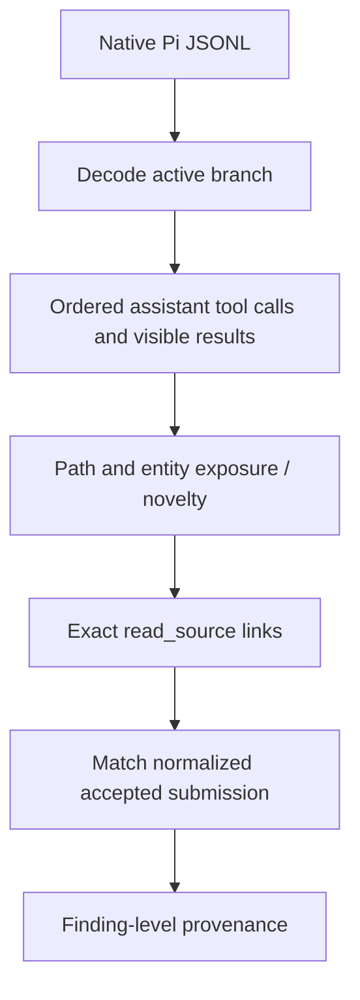

# ADR 0015 — Evidence and attribution contract

Status: accepted for phased implementation. Baseline: 26e6535 (local Routing development HEAD).

## Four sources of truth

1. **Model-visible observation:** the active native Pi branch, assistant tool calls and tool-result `content`. Private thinking, `details`, routing CustomEntry state, Graph databases and reference labels cannot establish observation.
2. **Business acceptance:** normalized FindingCandidate values in an accepted final submission and ReviewController state. A requested or rejected submission is not accepted.
3. **Evidence integrity:** exact immutable snapshot, revision, path, range and content hash, actually returned by read_source in this run. Integrity does not establish semantic correctness.
4. **Offline attribution:** the route by which accepted finding evidence first entered the model-visible context. It cannot change a finding or influence online decisions.

Business and evaluation use the same original events for different responsibilities. Recoverable tool validation errors must not invalidate independent accepted evidence chains; damaged native timelines must still fail closed.

## Observation transport and issue scope (P0)

MergeWarden results use one JSON object. Host metadata lives in `_mergewarden`, with `schemaVersion: 1` and optional notices. Routing preserves existing business fields and guidance wording, adding notices inside the object. Errors or non-JSON results are not rewritten into successful observations. SDK validation errors can remain plain text and are call-local.

The shared decoder supports historical JSON plus recognized separate routing notice blocks only for replay. New writers never emit that representation. It records typed issues with trace/call/finding scope and fatal/warning severity. Invalid JSONL, duplicate native identities, cycles, missing parents and corrupt call/result identity are fatal timeline errors. Expected tool errors and undecodable results are local. A missing result prevents proof through that call; unexplained missing events or snapshot contamination remain conservative.

G0 and G1 share ordering, status, exposure, novelty, source matching and normalized accepted-submission matching. Graph-specific adapters only interpret discovery locations. `partial` and `parse_incomplete` can establish a definite positive relation, with `coverageLimited=true`; no empty partial result proves absence. Entity search, general relation navigation and strict incoming CALLS are distinct assistance kinds. Attribution v3 never overwrites v2 results.

## Evidence delivery (P1, only after P0 gate)

A run-scoped ReviewEngine registry assigns deterministic IDs to successful read_source EvidenceRefs using all six identity fields. Submit transport accepts an explicit model-selected ID or a legacy full EvidenceRef. Resolution and stable deduplication precede integrity validation and any state mutation. Reports and FindingCandidate retain full EvidenceRefs. IDs absent from this run's registry are rejected, regardless of their format or origin.

Evidence Registry does not decide whether a finding is correct. Routing does not automatically attach evidence. Attribution never feeds back into runtime model decisions.

## Final submission boundary

All input, coverage, candidate, integrity and source-read checks finish before mutation. PRE_ACCEPTANCE_ERROR permits correction with unchanged business state. ACCEPTED is a single final transition and prohibits another final submission. PERSISTENCE_FAILURE poisons the run, forbids retry and prevents completed delivery.

First demonstrate the existing multi-event final batch failure with fault injection. If confirmed, introduce the minimal `final_batch.accepted` composite event for final_only. Preserve historical events and incremental_candidates restore semantics. Do not redesign the broader event model.

## Phased acceptance

P0: deterministic decoder/provenance tests, full verify, immutable v2 capture, both historical Routing datasets replayed twice with byte-identical v3 output. Only then implement registry and final acceptance. Final validation adds real offline Pi SDK → tools → engine → journal → native trace → analyzer fixtures, including recovery and persistence failures. Optional live delivery checks are capped at four previously used positives, after all engineering gates; they are not a quality experiment.

Graph v4, routing triggers/budgets/thresholds, B/C guidance, corpus, labels and model configuration remain frozen. Semantic correctness and evidence relevance remain separate human adjudication tasks.
